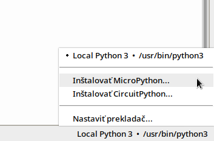
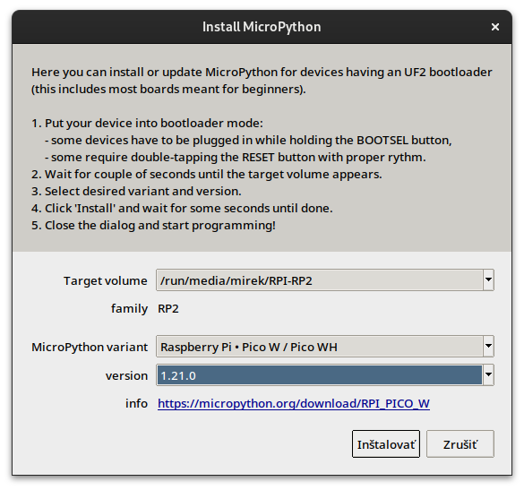
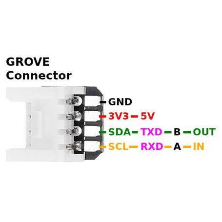
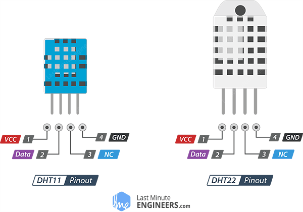
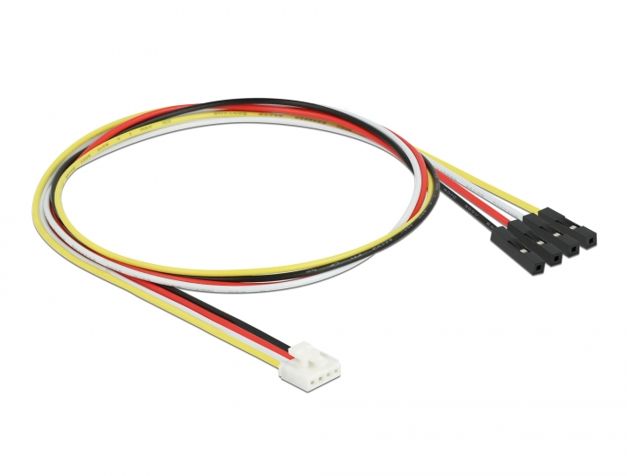
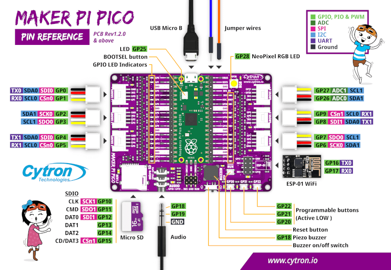

# Raspberry Pi Pico W MicroPython Workshop


Doska _Raspberry Pi Pico_ patrí do rodiny zariadení vyrobených nadáciou _Raspberry Pi Foundation_. Nejedná sa však o minipočítač, ako je to v prípade minipočítačov _Raspberry Pi_, ale jedná sa o dosku osadenú mikrokontrolérom _RP2040_. Vďaka cene, svojim vlastnostiam, komunite a podpore nadácie _Raspberry Pi Foundation_, je doska _Raspberry Pi Pico_ ideálnou pomôckou na výučbu programovania mikrokontrolérov. A počas tejto tvorivej dielne si predstavíme základy práce s touto doskou v jazyku _MicroPython_. Vytvoríme jednoduché riešenie, dosku pripojíme do internetu, potom pomocou HTTP protokolu stiahneme informácie o počasí, aby sme ich následne uložili do _Adafruit IO_ pomocou protokolu HTTP aj MQTT.

**Odporúčaný čas:** 180 minút

## Ciele

1. Naučiť sa základy práce v REPL režime jazyka _MicroPython_.
2. Naučiť sa pracovať so zabudovanou LED diódou a vnútorným senzorom teploty na doske.
3. Naučiť sa pripojiť dosku _Raspberry Pi Pico W_ do internetu pomocou zabudovaného _WiFi_ modulu.
4. Naučiť sa publikovať údaje z mikrokontroléra pomocou komunikačného protokolu _MQTT_.
5. Naučiť sa základy používania modulu `urequests` pre prácu s HTTP protokolom.

## Niekoľko tipov pre prácu s mikrokontrolérom

* Pico na doske neobsahuje tlačidlo `RESET`. Reštartovať ho je však jednoduché odpojením a opätovným pripojením USB kábla. Vyhnite sa však jeho odpájaniu a pripájaniu na strane mikrokontroléra! Vyhnete sa tak možnosti odtrhnutia tohto konektoru a tým pádom aj jeho celkovému poškodeniu. Miesto toho odpájajte USB kábel na strane počítača.

* V prípade, že chcete mikrokontrolér reštartovať softvérovo, môžete tak urobiť príkazom:

  ```python
  from machine import reset; reset()
  ```

* Softvérový reset zariadenia sa dá vykonať ešte jednoduchšie - stlačením klávesovej skratky `CTRL+D`


## Krok 0. Čo budeme potrebovať?

Ešte predtým, ako začneme, si pripravte nasledovné:

* Na svoj počítač nainštalujte jednoduchý editor kódu [Thonny](https://thonny.org/) a v jeho menu `Zobraziť` zaškrtnite voľby `Shell` a `Súbory`.
* Vytvorte si bezplatný účet v službe [openweathermap.org](https://openweathermap.org/).
* Vytvorte si bezplatný účet v službe [Adafruit IO](https://io.adafruit.com/).


## Krok 1. Nahratie firmvéru do mikrokontroléra

Ak chceme mikrokontrolér programovať v jazyku _MicroPython_, potrebujeme najprv do neho nahrať firmvér s týmto jazykom. S tým nám pomôže editor _Thonny_.

Pre nahratie firmvéru postupujte podľa tohto návodu:

1. Spustite editor _Thonny_.
2. Ak máte dosku _Raspberry Pi Pico_ pripojenú k počítaču, tak ju odpojte. Na doske stlačte a držte tlačidlo `BOOTSEL` a dosku pripojte k počítaču.
3. Po pripojení dosky tlačidlo pustite. Váš operačný systém pravdepodobne zobrazí notifikáciu o tom, že k vášmu počítaču bol pripojený USB disk s názvom `RPI-RP2`.
4. Kliknite na názov používaného interpretera jazyka _Python_ v pravom dolnom rohu editora _Thonny_ a zo zoznamu možností vyberte položku `Inštalovať MicroPython...`.
   
5. V dialógovom okne `Inštalovať MicroPython` vyberte umiestenie pripojenej dosky Raspberry Pi Pico, vyberte variant dosky a verziu jazyka MicroPython, ktorú chcete nainštalovať.
   
6. Kliknite na tlačidlo `Inštalovať`, čím sa spustí inštalácia.
7. Po skončení inštalácie zatvorte dialógové okno a v pravom dolnom rohu editora vyberte zo zoznamu vaše zariadenie s jazykom _MicroPython_ (napr. `MicroPython (Raspberry Pi Pico)`) .

Ak ste postupovali správne, v príkazovom riadku editora _Thonny_ by ste mali vidieť prompt jazyka _MicroPython_, napr.:

```
MicroPython v1.21.0 on 2023-10-06; Raspberry Pi Pico W with RP2040
Type "help()" for more information.
>>>
```

## Krok 2. Režim REPL a Hello world!

Jediný program, ktorý je v mikrokontroléri nahratý a spustený, je interpreter jazyka _MicroPython_. Komunikovať s ním je možné pomocou sériovej linky, kde uvidíme jeho rozhranie v režime REPL. To môžeme otestovať vypísaním textu `Hello world!` pomocou funkcie `print()`:

```python
>>> print('Hello world!')
Hello world!
>>>
```

Podobne, ako v prípade štandardného jazyka _Python_ môžeme režim REPL využiť na ladenie a experimentovanie.

## Krok 3. Pripojenie k internetu

Ako základ pre pripojenie do internetu použijeme funkciu z [dokumentácie jazyka MicroPython](https://docs.micropython.org/en/latest/esp32/quickref.html#networking), ktorá vyzerá takto:

```python
def do_connect():
    import network
    wlan = network.WLAN(network.STA_IF)
    wlan.active(True)
    if not wlan.isconnected():
        print('connecting to network...')
        wlan.connect('ssid', 'key')
        while not wlan.isconnected():
            pass
    print('network config:', wlan.ifconfig())
```

Mierne ju upravíme, aby jej parametrom bolo SSID pre pripojenie do siete a rovnako tak aj heslo:

```python
def do_connect(ssid, password):
    import network
    wlan = network.WLAN(network.STA_IF)
    wlan.active(True)
    if not wlan.isconnected():
        print('connecting to network...')
        wlan.connect(ssid, password)
        while not wlan.isconnected():
            pass
    print('network config:', wlan.ifconfig())
```

## Krok x. Aktualizácia času

Počas pripájania k internetu vieme rovno synchronizovať aj čas pomocou NTP protokolu. Aktualizujeme a upravíme funkciu `do_connect()` nasledovne:

```python
def do_connect(ssid, password):
    import network, ntptime, machine
    wlan = network.WLAN(network.STA_IF)
    wlan.active(True)
    if not wlan.isconnected():
        print('>> Connecting to network...')
        wlan.connect(ssid, password)
        while not wlan.isconnected():
            pass
    print('>> Network config:', wlan.ifconfig())

    # set time and date with NTP
    print('>> Synchronizing time...')
    ntptime.settime()
    rtc = machine.RTC()
    now = rtc.datetime()
    print(f'>> Current time: {now[0]}-{now[1]:02}-{now[2]:02}T{now[4]:02}:{now[5]:02}:{now[6]:02}Z')
```

**Poznámka:** Pri pripojení pomocou editora ako Thonny alebo nástroja `rshell`, dôjde k synchronizácii času automagicky. Počas reálnej prevádzky synchronizáciu musíme zabezpečiť sami.

## Krok x. Inštalácia doplnkových modulov

Pred verziou 1.20 sa používal modul `upip`, ktorý predstavoval MicroPython verziu nástroja `pip` pre inštaláciu balíkov. Od verzie 1.20 je však súčasťou firmvéru s MicroPython-om balík s názvom `mip`. Ten neinštaluje balíky z [PyPi](https://pypi.org), ale z repozitára [micropython-lib](https://github.com/micropython/micropython-lib):

Nainštalovať nový modul môžeme priamo pomocou REPL. Najprv importneme modul `mip`:

```python
>>> import mip
```

A následne nainštalujeme príslušný balík pomocou:

```python
>>> mip.install('umqtt.simple')
```

Inštalované moduly sa inštalujú do priečinku `/lib/` v mikrokontroléri.

## Krok x. Pripojenie modulu DHT11



Senzory DHT11 a DHT22



Modul Waveshare DHT11:


Prepojenie modulu Waveshare DHT11



## Krok x. Publikovanie údajov cez protokol MQTT

### Pripojenie sa k MQTT brokeru

Ak máme nainštalovaný balík `umqtt.simple`, tak sa môžeme pripojiť:

```python
from umqtt.simple import MQTTClient

mqtt = MQTTClient('client-id', 'broker.ip', keepalive=60)
mqtt.connect()
```

**Poznámka:** Ak používate novšiu verziu brokera _Mosquitto_, nezabudnite pridať parameter `keepalive` s hodnotou inou ako `0`. Ináč vám bude vracať kód `2`.

Pre lepšiu diagnostiku chybových kódov vám pomôže nasledujúca tabuľka. Podľa [dokumentácie](https://clouddocs.f5.com/api/irules/MQTT__return_code.html) metóda pri pripájaní môže vrátiť jednu z nasledujúcich chybových kódov:

| kód | význam |
|-------|------------|
| `0` | Connection Accepted. |
| `1` |  Connection Refused. Protocol level not supported. |
| `2` | Connection Refused. The client-identifier is not allowed by the server. |
| `3` | Connection Refused. The MQTT service is not available. |
| `4` | Connection Refused. The data in the username or password is malformed. |
| `5` | Connection Refused. The client is not authorized to connect. |
| `6` - `255` | Reserved for future use. |


## Krok x. Bliknutie LED diódou

Priamo z REPL režimu jazyka MicroPython:

```python
>>> from machine import Pin

>>> led = Pin('LED', Pin.OUT)
>>> led.on()
>>> led.off()
```

Na Cytrón doske je ku každému Pin-u pripojená stavová LED dióda. Takže to isté si môžeme vyskúšať na ľubovoľnom Pin-e:

```python
>>> from machine import Pin

>>> led = Pin(26, Pin.OUT)
>>> led.on()
>>> led.off()
```

## Krok x. Neopixel

```python
from machine import Pin
from neopixel import NeoPixel

np = NeoPixel(Pin(28, Pin.OUT), 1)
np[0] = (255, 255, 255)
np.write()
```


## Krok.x REPL režim

Pár typov:

* `CTRL+D` - soft reset

## Ďalšie zdroje

* [Raspberry Pi Pico and Pico W](https://www.raspberrypi.com/documentation/microcontrollers/raspberry-pi-pico.html) - technická dokumentácia pre rodinu mikrokontrolérov _Raspberry Pi Pico_
* [Package management](https://docs.micropython.org/en/latest/reference/packages.html?highlight=mip) - dokumentácia ku modulu `mip` pre správu balíčkov na mikrokontroléri s jazykom MicroPython
* [Propojka z Grove konektoru na 4 pin dupont samice](https://rpishop.cz/propojky/2167-propojka-z-grove-konektoru-na-4-pin-dupont-samice-5-kusu-v-baleni.html)
* https://wokwi.com/


## Licencia

Uvedené dielo podlieha licencii [Creative Commons BY-NC-SA 4.0](https://creativecommons.org/licenses/by-nc-sa/4.0/deed.cs).


1. najprv si pripravíme prostredie - editor Thonny a nahráme firmvér do mikrokontroléra
2. hneď potom sa pripojíme k WiFi AP pomocou WiFi modulu, ktorý sa na doske nachádza
3. potom pomocou HTTP protokolu ukradneme údaje o aktuálnom počasí
4. potom pomocou HTTP protokolu tieto údaje pošleme do služby Adafruit IO, ktorá nám umožní tieto údaje uchovávať, vizualizovať a vytvárať rozličné dashboard-y
5. následne si ukážeme, že údaje o počasí vieme do služby Adafruit IO poslať aj pomocou protokolu MQTT, až na to, že modul pre podporu tohto protokolu potrebujeme do mikrokontroléra nahrať ručne, pretože ho základný firmvér neobsahuje
6. sťahovanie a publikovanie údajov budeme vykonávať v pravidelných intervaloch, k čomu nám pomôžu časovače
7. a ako bonus navyše vytvorím jednoduchý dekorátor, ktorý rozsvieti LED diódu na doske vždy, keď sa začne sťahovanie a publikovanie údajov do služby Adafruit IO



